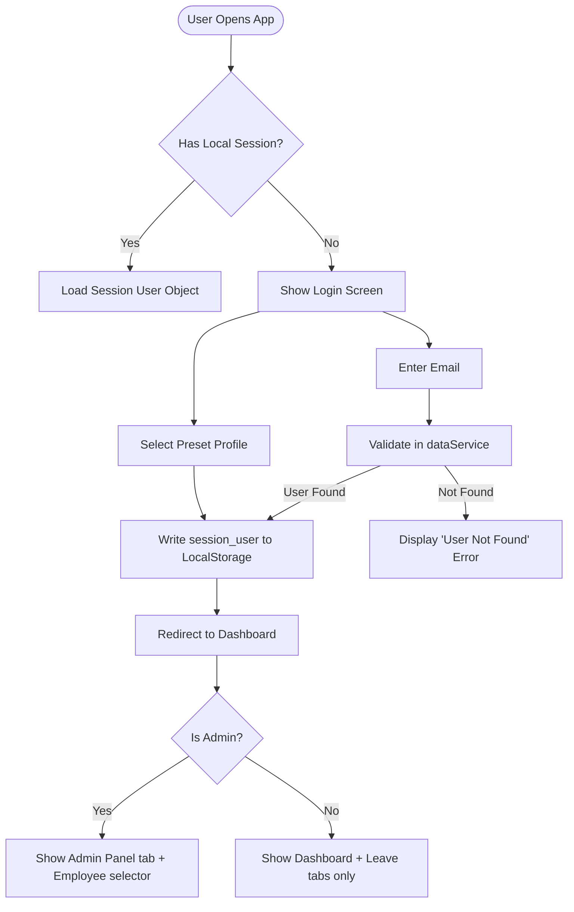
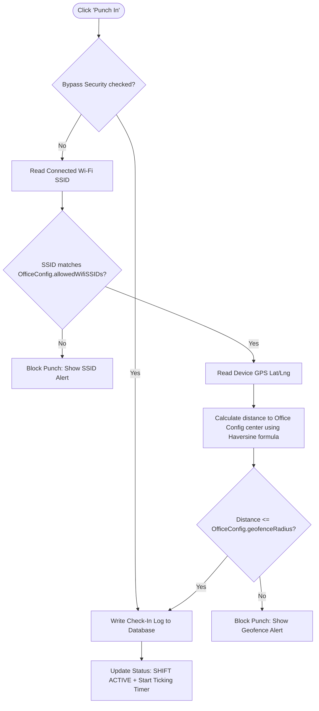
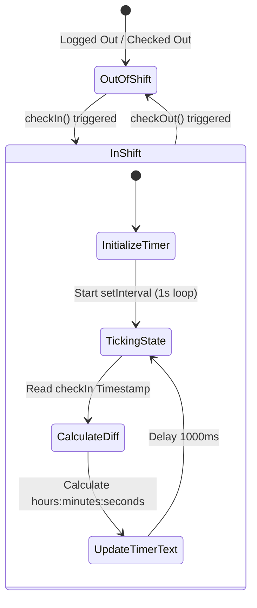

# Architecture Memory Map (Graphify)

This document visualizes the system's state machines, data patterns, and security guardrails using Mermaid graphs to preserve architectural structure.

---

## 🧭 1. Authentication & Session Flow

How the client manages login sessions and role-based views.



---

## 🔒 2. Check-In Security Validation Pipeline

The technical sequence applied during checking-in to guarantee that employees are physically inside the office and on company Wi-Fi.



---

## ⏱️ 3. Shift Active State & Duration Ticking

How the active shift clock computes real-time working hours.



---

## 🗄️ 4. Local Database Persistence Model

Visual mapping of tables and key attributes currently managed in `localStorage` and slated for Supabase.

```mermaid
erDiagram
    users {
        string id PK
        string email
        string fullName
        string role "admin | employee"
        string avatarUrl
        string officeId FK
    }

    attendance_logs {
        string id PK
        string userId FK
        string userName
        string checkIn "ISO Date"
        string checkOut "ISO Date"
        string checkInIp
        string checkInWifi
        json checkInLocation "lat, lng"
        string status "present | late"
        int durationMinutes
    }

    leave_requests {
        string id PK
        string userId FK
        string userName
        string startDate "YYYY-MM-DD"
        string endDate "YYYY-MM-DD"
        string type "sick | vacation | casual"
        string status "pending | approved | rejected"
        string reason
    }

    office_config {
        string id PK
        string name
        float lat
        float lng
        int geofenceRadius "meters"
        stringallowedWifiSSIDs "array"
    }

    users ||--o{ attendance_logs : "creates"
    users ||--o{ leave_requests : "submits"
    office_config ||--o{ users : "governs"
```
