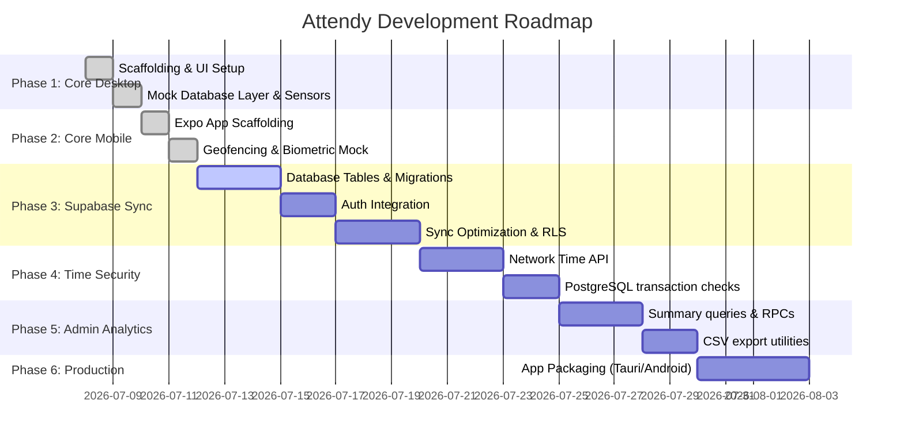

# Product Roadmap: Attendy Office Attendance System

This roadmap details the progression phases for building and launching the Attendy Office Attendance System.

---

## 🗺️ Milestone Milestones

---

## 📌 Phase Descriptions

### Phase 1: Offline Desktop Application (Complete)
*   **Goal:** Construct a highly reactive desktop app with Tauri + React + TypeScript.
*   **Features Delivered:**
    *   Premium Dark Glassmorphic Dashboard UI.
    *   Ticking active work shift counter.
    *   Mock sensor panel allowing testers to simulate connecting to different Wi-Fi networks, spoofing GPS coordinates, and tweaking system IPs.
    *   Admin configuration panel allowing geofencing bounds adjustments directly from the UI.
    *   Complete `localStorage` persistence layer.

### Phase 2: Offline Mobile Application (Complete)
*   **Goal:** Build a matching client for Android and iOS using Expo (React Native).
*   **Features Delivered:**
    *   Native location sensors checking coordinate bounds.
    *   Native biometric prompts (Fingerprint/FaceID simulation) triggered on punch-in.
    *   Diagnostic panels verifying mock settings versus active GPS inputs.
    *   Responsive tab routing and leave request forms.

### Phase 3: Supabase Sync Integration (Current Phase)
*   **Goal:** Move database storage from localStorage/AsyncStorage to Supabase cloud.
*   **Planned Features:**
    *   Supabase SQL tables creation + Auth client settings.
    *   Row-Level Security (RLS) integration (employees read/write only their own logs; managers read all logs).
    *   Real-time admin sync.

### Phase 4: Tamper Prevention & Time Security
*   **Goal:** Secure clock check-ins against local system clock manipulation using network-independent public timezone APIs and SQL transaction timestamp integrity rules.

### Phase 5: Admin Analytics & Reports
*   **Goal:** Build real-time stats aggregation procedures and export payroll-compliant CSV logs of work shifts directly from the admin dashboard.

### Phase 6: Production Build & Packaging
*   **Goal:** Bundle and compile client packages for distribution (Windows `.exe` and Android `.apk`).
